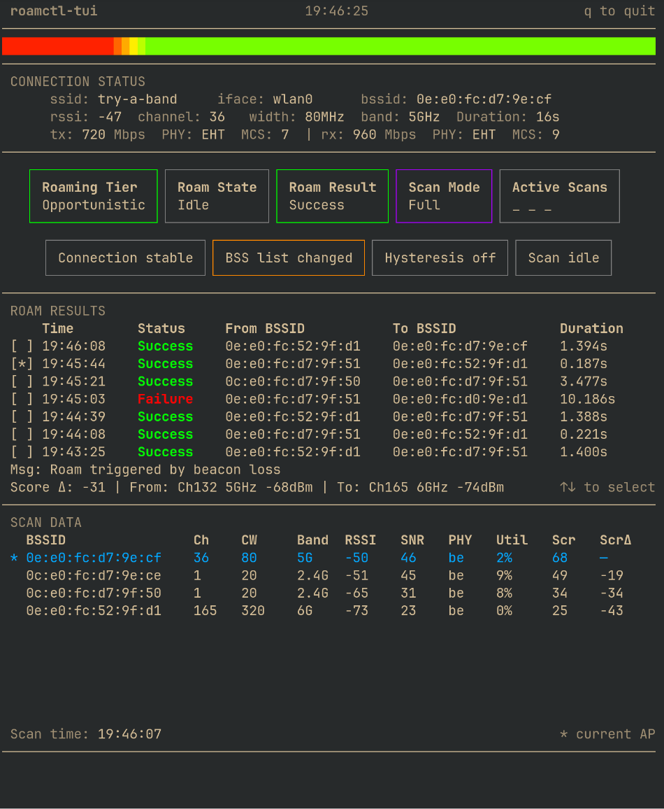

# roamctl
roamctl is a Linux utility that provides a fully configurable Wi-Fi roaming service. It is written in Go, and exclusively utilizes the wpa_supplicant control interface for Wi-Fi operations.

This utility may serve as a replacement wpa_supplicant's standard roaming module,`bgscan`. The goal is to coexist with the existing Wi-Fi networking stack, and not to replace wpa_supplicant or NetworkManager's core functionality. Therefore, roamctl can act as a more sophisticated and configurable roaming algorithm while leaving the rest of your Linux network configuration as-is.

The core of roamctl is a highly configurable roaming algorithm. It consists of signal and connection quality monitoring, a multi-tiered roaming aggressiveness hierarchy, and a score-based algorithm to determine the "best" AP to roam to.

The roaming algorithm allows optimizing roaming performance, or it can be used to test unique scenarios. For one example, band preference can be defined: `6ghz = 100`, `5ghz = 60`, `2point4ghz = 20` will aggressively bias toward 6GHz.  See [Configuration](#Configuration) for full parameter reference.


> [!NOTE]
> When roamctl is running, it automatically adjusts configuration to disable wpa_supplicant's autonomous roaming. When the program exits or is otherwise stopped, wpa_supplicant's original configuration is restored.

### TUI
 `roamctl-tui` is included, which shows the live state of roamctl in a clean and compact interface:
 



## Quick Start

### One-line install
Automatically downloads and installs the Linux binary for AMD64, ARM64, or ARM32 devices. 
```
curl -fsSL https://raw.githubusercontent.com/jwil007/roamctl/master/install.sh -o /tmp/install.sh && bash /tmp/install.sh
```
The one-line install provides the option to run roamctl as a systemctl service. If running as a service, start with:
```
sudo systemctl start roamctl@<iface_name>
```
Interface name must be specified when running as service. For example, `roamctl@wlan0`

Launch TUI:
```
sudo roamctl-tui
```
View logs with:
```
journalctl -u roamctl -f
```
Run in the foreground to see logs in stdout, or edit configuration settings by running `sudo roamctl` and appending any flags. See [Usage](#Usage) for details.
### Build from source
<details>
  <summary>Click to expand</summary>
  Make sure you have installed Go for Linux: https://go.dev/doc/install.

Builds and installs to `$GOPATH/bin`. Most likely this is `~/go/bin`. 

```
go install github.com/jwil007/roamctl/cmd/roamctl@latest
```
 
If running `roamctl` after the Go install returns "command not found", make sure the go/bin directory is in your path.

The command below will add the path config for your default shell. After running the command, restart your shell session, and you should be able to run `roamctl`.
```
 echo 'export PATH=$PATH:$HOME/go/bin' >> ~/.$(basename $SHELL)rc
 ```

</details>

## Algorithm details
The roaming algorithm consists continuous signal polling, concurrent background scanning, and four different tiers based on signal metrics to determine roaming behavior.

### Roaming Tiers
There are four tiers which set roaming behavior to optimize roaming in a wide variety of environments. The tiers are based on RSSI breakpoints, which are user configurable.

There also exists a connection health monitoring system, which looks at retry rate and data rate - if the connection is determined to be unhealthy, the Critical tier is entered to find a better AP. Connection health metrics are also user configurable.

#### Excellent | Roaming Disabled
In the Excellent tier, background scanning is paused and no roaming will occur.

#### Fair | Opportunistic Roaming
In the Fair tier, backgound scanning begins using a smart scan to only scan relevant channels. Background scan results are evaluated, and if an AP is significantly better than the current AP, a roam will occur.

#### Degraded | Active roaming 
In the Degraded tier, active roaming begins. When this tier is entered a scan on targeted channels is performed to see if a better AP is available. If a better AP is not found, a full scan is requested for the next background scan interval.

#### Critical | Aggressive roaming
When the critical tier is entered, another immediate fast scan is triggered. If no better APs are found, a full scan is run inline, rather than waiting for the next background scan interval. The score delta required to roam is lower in this tier by default.
### Visual Diagram
A flow chart diagram is avaialble for a simplified view at the roaming algorithm.
[Algorithm flowchart](/docs/algorithm-chart.md).

### Scoring
BSSIDs in the scan results are scored using a weighted combination of RSSI, SNR, Band, channel utilization, PHY type, etc. The scoring parameters and weights are user-configurable, See [Configuration](#Configuration).

### Scanning and Stability 
A number of stability guards are in place to prevent excessive roaming, scanning or ping-ponging. These guards include:
- A score_delta parameter to ensure that the candidate AP is materially better than the current AP
- A smart scanning algorithm is used to minimze time spent scanning, by scanning only channels known to have candidate APs. Full sweeps are only done when needed.
- Detection of in-flight connection events to back off any roaming/scanning activies. This is particularly important in cases where a lower level connection change happens, such as a disconnection triggered outside of the roaming context.
- [Hysteresis methods](https://en.wikipedia.org/wiki/Hysteresis#Control_systems) to prevent freqently entering the roam cycle when at a borderline signal strength

> [!IMPORTANT]
> While effort has been made to ensure stability in various edge cases, this is not a battle-tested roaming algorithm. It is meant primarily to be a tool for Wi-Fi engineers, allowing easy access to test and simulate client behavior.

## Usage

### Daemon mode
Use the one-line install from [Quick Start](#Quick-Start) for automated setup. For manual setup, move the `roamctl@.service` file into the `/etc/systemd/system/` directory, then run `sudo systemctl daemon-reload`.
> [!NOTE]
>roamctl has multi-interface support. When managing the service through systemctl, you need to append the interface name. For example `roamctl@wlan0`

Start the service:
```
sudo systemctl start roamctl@<iface>
```
Stop the service:
```
sudo systemctl stop roamctl@<iface>
```
View logs:
```
journalctl -u roamctl@<iface> -f
```
Enable at boot:
```
sudo systemctl enable roamctl@<iface>
```

### Multi-interface
roamctl supports running independent instances per wireless interface. Each instance has its own config, state, and IPC socket, keyed by interface name.

To run multiple instances:
```
sudo systemctl start roamctl@wlan0
sudo systemctl start roamctl@wlan1
```

Each instance is managed and logged independently. This is a power-user feature; the standard installation configures for a single interface automatically.

### Foreground mode
Connect to an SSID. Run with `sudo roamctl`. Exit with `ctrl+c`.

### Flags:
Use these arguments to make configuration changes or view debug logs. Run with `sudo roamctl -<ARG> <value>`

`-edit` : Edit config file. Checks for $EDITOR env variable, otherwise tries nano, then vi.

`-iface`: Specify wireless interface. Default is `wlan0`.

`-level` : Set log level. Options are `info` or `debug`. Default is `info`

`-template`: Select config template. Right now the only option is `base`. Other templates will be added in the future.

### Uninstall
This one line command removes all system files and systemctl service configuration.
```
sudo systemctl stop 'roamctl@*'; sudo systemctl disable 'roamctl@*'; sudo rm -f /etc/systemd/system/roamctl@.service; sudo rm -rf /etc/roamctl; sudo rm -rf /run/roamctl; sudo rm -f /usr/local/bin/roamctl; sudo rm -f /usr/local/bin/roamctl-tui
```


## A note on 6GHz
The version of wpa_supplicant that ships with most Debian based distros (v2.10) may not reliably find 6GHz APs in the scan results. If you're testing 6GHz roaming, check your version with `wpa_supplicant -v`. If you have v2.11 or newer, 6GHz should be reliable.


## Configuration

All config parameters, including interface specification and scoring weights for the roaming algorithm, are set through the toml file at `~/.config/roamctl/<iface>.toml`

For convenience, running with the `-edit` flag opens a text editor to edit the file directly.


>[!NOTE]
>roamctl initializes with the params shown in the default config below.

## Default Config
```toml
[preferences]
# Toggle support for 802.11v (bss transition mgmt)
enable_btm = true

[roaming_tiers]
# These values set the floor of each RSSI tier, which dictate roaming logic
# i.e. if fair_rssi is -67, -68 is in the "degraded" tier.
excellent_rssi = -50
fair_rssi = -65
degraded_rssi = -73
# values lower than degraded are considered critical

# Set score deltas required to roam per tier
# Higher numbers mean candidate AP must be significantly better
fair_score_delta = 7
degraded_score_delta = 6
critical_score_delta = 4

[stability]
# sets cooldown duration after connection changed
# prevents roaming while cooldown is in effect
connection_cooldown = "5s"

# set maxmimum retry rate (percent) or minimum data rate (Mbps) or min MCS index
# Connection considered unstable when values outside of these bounds
# Unstable connection causes a roam attempt to fire
retry_rate = 75
data_rate = 10 #Mbps
mcs_index = 2
# modifier to penalize score of unhealthy AP, needed to encourage roaming to different AP
unhealthy_score_mod = 20

# These values define upper and lower bounds RSSI must cross before re-roaming
# This is meant to prevent ping-ponging when at RSSI boundry
rssi_hysteresis_up = 5
rssi_hysteresis_down = 5

# This value is used as an upward RSSI buffer when the roaming tier is evaluated
# It prevents frequent tier oscilation when at an rssi boundry
tier_hysteresis = 5

# Set number of samples to avg rssi over
# Alleviates transient RSSI changes triggering roam logic
# Must be an integer from 1 to 10. 0 is not allowed.
rssi_smooth_window = 5

[timing]
# Timings for signal polling (e.g. hosts current RSSI, SNR) and bg scan interval
sig_poll_interval = "100ms"
base_scan_interval = "30s"

# Defines number of bssids used to build fast-scan channel list
# In very dense environments, this number can be tuned to optimize channel scanning
max_bss_ct = 15

[score_weights]
# These tune the scoring algorithm, which ranks candidate APs
# Set to 100 for maxmium weight, 0 to ignore category
rssi = 100
snr = 0
qbss_util = 15
band = 35
channel_width = 10
phy_type = 15

# RSSI has a multiplicative below the knee, using an exponential curve
rssi_knee = -68
rssi_exponent = 1.8

[score_clamps]
# Used for RSSI and SNR scoring.
# Values below min are scored 0, values above max are score 100
# Values between clamps are scored linearly
min_rssi = -82
max_rssi = -25
min_snr = 10
max_snr = 50

# Use the following to adjust various scoring. This is where you can 
# tweak band pref, cw pref, etc.
[band_scores]
2point4ghz = 0
5ghz = 80
6ghz = 100

[chan_width_scores]
20mhz = 40
40mhz = 40
80mhz = 75
160mhz = 85
320mhz = 100

[phy_scores]
legacy = 0
80211n = 20
80211ac = 50
80211ax = 80
80211be = 100
```
