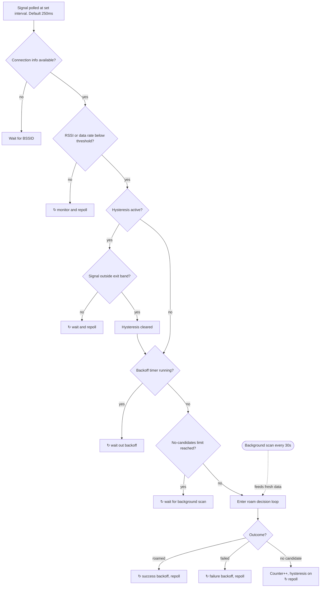

```mermaid
flowchart TD
    A[Signal polled at set interval. Default 250ms] --> B{Connection info available?}
    B -- no --> C[Wait for BSSID]
    B -- yes --> D{RSSI or data rate below threshold?}
    D -- no --> E[↻ monitor and repoll]
    D -- yes --> F{Hysteresis active?}
    F -- yes --> G{Signal outside exit band?}
    G -- no --> H[↻ wait and repoll]
    G -- yes --> I[Hysteresis cleared]
    I --> J
    F -- no --> J{Backoff timer running?}
    J -- yes --> K[↻ wait out backoff]
    J -- no --> L{No-candidates limit reached?}
    L -- yes --> M[↻ wait for background scan]
    L -- no --> N[Enter roam decision loop]
    N --> O{Outcome?}
    O -- roamed --> P[↻ success backoff, repoll]
    O -- failed --> Q[↻ failure backoff, repoll]
    O -- no candidate --> R[Counter++, hysteresis on\n↻ repoll]
    S([Background scan every 30s]) -.->|feeds fresh data| N
```
