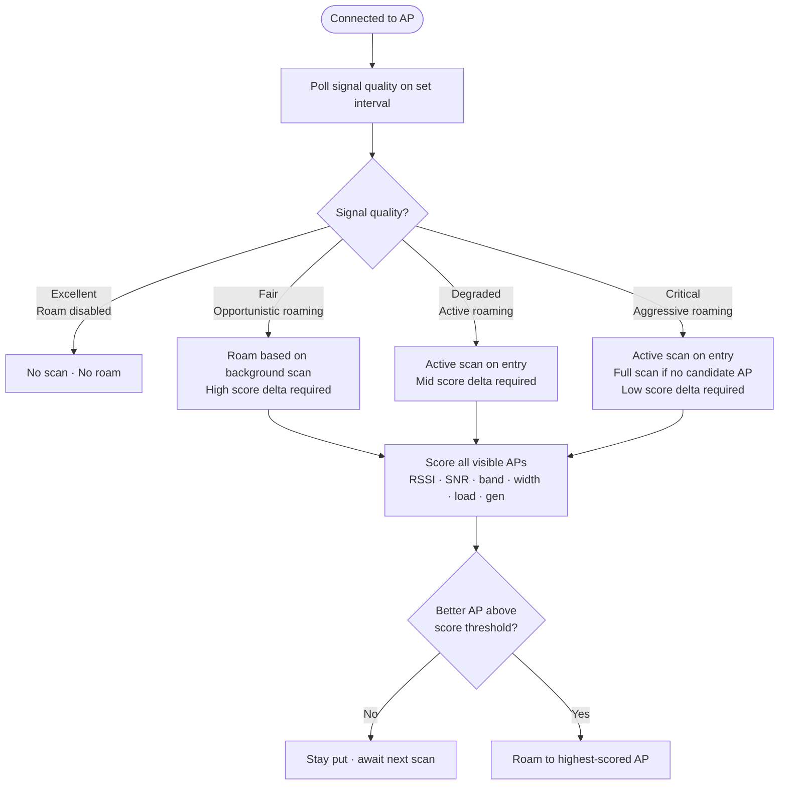

```mermaid
flowchart TD
    A([Connected to AP]) --> B[Poll signal quality on set interval]
    B --> C{Signal quality?}

    C -->|Excellent\nRoam disabled| D[No scan · No roam]
    D 

    C -->|Fair\nOpportunistic roaming| E[Roam based on background scan\nHigh score delta required]
    E --> H

    C -->|Degraded\nActive roaming| F[Active scan on entry\nMid score delta required]
    F --> H

    C -->|Critical\nAggressive roaming| G[Active scan on entry\nFull scan if no candidate AP\nLow score delta required]
    G --> H

    H[Score all visible APs\nRSSI · SNR · band · width · load · gen] --> I{Better AP above\nscore threshold?}

    I -->|No| J[Stay put · await next scan]
    J 

    I -->|Yes| K[Roam to highest-scored AP]
    K 
```
