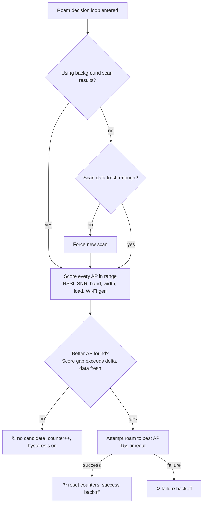

```mermaid
flowchart TD
    A[Roam decision loop entered] --> B{Using background scan results?}
    B -- yes --> D
    B -- no --> C{Scan data fresh enough?}
    C -- no --> C2[Force new scan] --> D
    C -- yes --> D[Score every AP in range\nRSSI, SNR, band, width, load, Wi-Fi gen]
    D --> E{Better AP found?\nScore gap exceeds delta, data fresh}
    E -- no --> F[↻ no candidate, counter++, hysteresis on]
    E -- yes --> G[Attempt roam to best AP\n15s timeout]
    G -- success --> H[↻ reset counters, success backoff]
    G -- failure --> I[↻ failure backoff]
```
